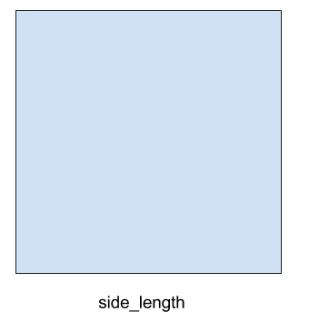
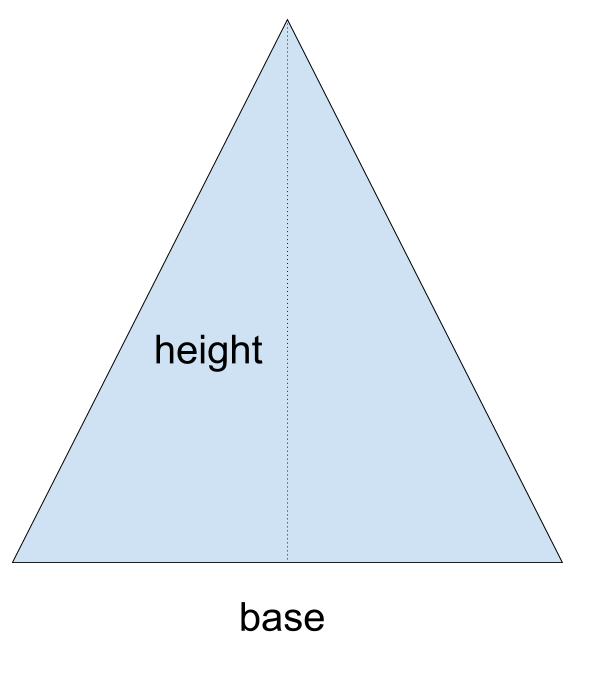
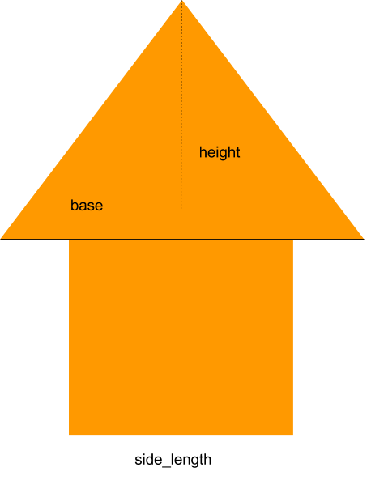
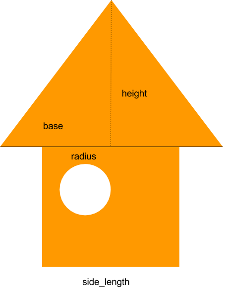

# Functions, Subsitution model and namespace
By Chung-hong Chan (@chainsawriot)

## Functions: in a non-computer context

The highest point of Victoria Peak is 552 metres. What is highest point of Victoria Peak in feet?

You may know 1 metres = 3.281 feet. Therefore, 552 metres can be converted into feet by:

```
552 * 3.281 = 1811.11
```

Another way to represent the same idea is to create a function, suppose we define a function called `f(x)`

```
f(x) = x * 3.281
```

`f` is the name of the function and `x` is the *argument* of that function. `x * 3.281` is the body of that function. Merely defining a function will not give you the answer, you need to put such function into use to get the answer.

```
f(x = 552) = ?
```

How can we arrive at the answer? we can derive the answer using the *subsitution model*. In this example, when the argument x is 552, we can subsitute the value of x in the function body with 552.

```
f(x = 552) = 552 * 3.281 = 1811.11
```

Excercise 1: The highest point of Tai Mo Shan is 957 metres. Convert it to feet using f(x) by subsitution.

Similarly, you can define more functions for unit conversion, e.g.

Celcius to Fahrenheit, `g(c)`

```
g(c) = c * (9/5) + 32
```

Currency conversion: from Hong Kong Dollar to Euro, `h(hkd)`

```
h(hkd) = hkd * 0.11533
```

And it is not only about mathematics. You can define a function to find out the capital city of a country, `i(country)`

```
i(country) = Google for country + "capital"
```

### A project: Area calculation

The area of a square can be calculate with a function like this:



```
square_area(side_length) = side_length * side_length
```

This function can be defined in R as such:

```{r}
square_area <- function(side_length) {
  return(side_length * side_length)
}
```

Try to calculate the area of square using this function

```{r}
square_area(side_length = 68.9)
### it can be shorthanded to
square_area(68.9)
```

For the area of triangle, you might know that it is calculated as: (base * height) / 2



To define it as a function, you need to define a function with two arguments.

```
triangle_area(base, height) = (base * height) / 2
```
This function can be defined in R as such:

```{r}
triangle_area <- function(base, height) {
  return((base * height) / 2)
}
```


Try to calculate the area of triangle using this function

```{r}
triangle_area(base = 92.8, height = 68.9)
### it can be shorthanded to
triangle_area(92.8, 68.9)
```

Now, you need to build a function to calculate the area of a 'house' like this



You can actually reuse the `square_area` and `triangle_area` you have just defined to calculate the 'house' area.

```
house_area(side_length, base, height) = square_area(side_length) + triangle_area(base, height)
```

```{r}
house_area <- function(side_length, base, height) {
  return(square_area(side_length) + triangle_area(base, height))
}
```

### Intermediates

Programs are meant to be read by human. A better approach is to write it clearly so that we know how it works.

You can create `intermediates` in your function (such as bottom_area and upper_area) so that you know the 'house' area is actually a combination of square and triangle area.

```{r}
house_area2 <- function(side_length, base, height) {
    bottom_area <- square_area(side_length)
    upper_area <- triangle_area(base, height)
	return(bottom_area + upper_area)
}
```

A side note about those intermediates. You cannot get back those intermediates after you use that function. i.e.

```{r}
house_area2(10, 14, 5)
bottom_area # Error: object 'bottom_area' not found
```

It is related to a concept called "Namespace". But it is beyond the scope of this class and what you need to know (now) is that you can only get back the returned value.

### Window

Suppose you need to calculate the area of a new version of `house`. It has one circular window.



Given the area of circle is: radius * radius * 3.1416

Modify `house_area2` to `house_area3` so that it can calcuate the area of the new house.


```{r}
house_area3 <- function(side_length, base, height, radius) {
    bottom_area <- square_area(side_length)
    upper_area <- triangle_area(base, height)
	window_area <- radius * radius * 3.1416
	return(bottom_area + upper_area - window_area)
}
house_area3(10, 14, 5, 2)
```

### default argument

Suppose the radius of window is usually be 2. You can put this as default like this.

```{r}
house_area3 <- function(side_length, base, height, radius = 2) {
    bottom_area <- square_area(side_length)
    upper_area <- triangle_area(base, height)
	window_area <- radius * radius * 3.1416
	return(bottom_area + upper_area - window_area)
}
house_area3(10, 14, 5) # radius will be by default 2
house_area3(10, 14, 5, 1) # You can still use other value
```
