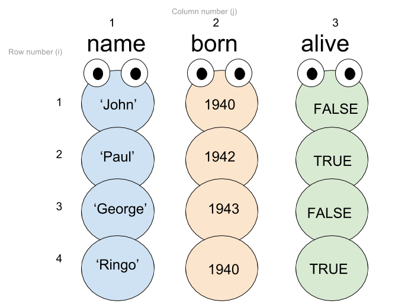

# Bracket notation
By Chung-hong Chan (@chainsawriot)

Square brackets `[]` in R are for subseting vector, data.frame and list.

## Vector

A vector is like a container of multiple elements of the same type. (e.g. a vector of all numbers) For example, I can create a vector called `prime` that hold the first few prime numbers.

```{r}
prime <- c(2, 3, 5, 7, 11, 13, 17, 19, 23, 29)
```
Visually, the vector `prime` is like a caterpillar.


### Subsetting a vector

"Subsetting a vector" is the operation of extracting element(s) from a vector. For example, you want to extract the elements 11 and 19 from the vector `prime`, visually it should be like this (a cruel image):


There are multiple ways to subset data from a vector using square brackets. The two common methods are:

#### Using positional index

Single numerical positional index

```{r}
# first element, i.e. 2
prime[1]
# third element, i.e. 5
prime[3]
# Get the number of elements in a vector, i.e. 10
length(prime)
# Revision excercise 1: explain to yourself why this one will 29, hints: try prime[10]
prime[length(prime)]
# Revision excercise 2: how to get the value 19 from prime using length(), hints: try prime[10-2]
```

Multiple numerical positional indices

```{r}
# create an "index vector": just a numeric vector
c(1,3)
# get the first and third elements
prime[c(1,3)]
# get the first, third and last elements
prime[c(1,3,length(prime))]
# Revision excercise 3: how to the get the 19, 23 and 29 from the prime?
```

#### Using logical vector

Using a logical vector with the equal length of `prime` to select elements, only elements with the corresponding logical value being TRUE will be extracted. For example:

```{r}
# Do the above cruel subsetting operation, i.e. extracting 11 and 19
prime[c(FALSE, FALSE, FALSE, FALSE, TRUE, FALSE, FALSE, TRUE, FALSE, FALSE)]
```

Visually, it should be like this


```{r}
# Revision excercise 3: Try to rewrite the following subsetting operation with a logical vector
prime[c(1,3)]
```
##### Making query [IMPORTANT]

In real life, we rarely know the position of the elements to be extracted. Usually, we extract elements from a vector based on the values. Combining the vectorised logical operation and subsetting vector using logical vector, we can make query on vectors. Let's revise a little bit about the vectorised logical operations.

```{r}
prime > 10
prime != 29
prime <= 23
# Revision excercise  4: Explain to yourself the logic of the following logical operation
prime %% 2 == 1 
```

The above vectorised logical operation will always evaluate to a logical vector with the equal length of `prime`. Therefore, we can make use of this to query the `prime` vector.

```{r}
prime[prime > 10]
prime[prime != 29]
prime[prime <= 23]
prime[prime %% 2 == 1]
```
## Data frame

Data frame is like a collection of vectors with same length. It is usually used to represent rectangular data. In the following `beatles` data frame, each row represents one single member of the Beatles.

```{r}
beatles <- data.frame(name = c('John', 'Paul', 'George', 'Ringo'),
born = c(1940, 1942, 1943, 1940),
alive = c(FALSE, TRUE, FALSE, TRUE))
```

Visually, it looks like this:



You can use the above two methods to subset a data frame. However, a data frame is a 2D structure (it has rows and columns), therefore you need to subset it with two index values. Suppose we called them `i` and `j` with `i` being the row indices and `j` being the column indices. The notation for subsetting a data frame is `yourdataframe[i,j]`. Examples:

```{r}
# First row, i = 1
beatles[1,]
# First and Third rows, i = c(1,3)
beatles[c(1,3),]
# Second Column, j = 2
beatles[,2]
# It is the same as
beatles$born
# The third row, third colum, i = 3, j = 3
beatles[3,3]
# The first three rows, only the first colum, i = 1:3, j = 1
beatles[1:3,1]
# The same as
beatles$name[1:3]
# Revision excercise 4: Explain why the above have no j value inside the [].
```

Similarly, you can put logical vector into `i` and `j`. We will usually use the logical vector in `i`.

```{r}
# the same as beatles[c(1,3),]
beatles[c(TRUE, FALSE, TRUE, TRUE),]
# Revision excercise 5: Explain the result of
beatles[!beatles$alive,]
```

You can also use vectorised logical operation on rows to query on a data frame.

```{r}
# Vectorised logical operation on the 'name' column
beatles$name == 'John'
# Select beatles with the name of 'John'
beatles[beatles$name == 'John',]
# Vectorised logical operation on the 'born' column
beatles$born <= 1940
# Select beatles who born <= 1940
beatles[beatles$born <= 1940,]
# Combining logical vectors with & operator
# e.g. logical operation of born <= 1940 and still alive
beatles$born <= 1940 & beatles$alive
# Select beatles who born <= 1940 and still alive
beatles[beatles$born <= 1940 & beatles$alive,]
# Revision excercise: Explain the result of
beatles$name[beatles$born <= 1940 & beatles$alive]
```
