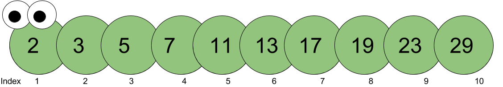

# Bracket notation
By Chung-hong Chan (@chainsawriot)

Square brackets `[]` in R are for subseting vector, data.frame and list.

## Vector

A vector is like a container of multiple elements of the same type. (e.g. a vector of all numbers) For example, I can create a vector called `prime` that hold the first few prime numbers.

```{r}
prime <- c(2, 3, 5, 7, 11, 13, 17, 19, 23, 29)
```
Visually, the vector `prime` is like a caterpillar.



### Subsetting a vector

"Subsetting a vector" is the operation of extracting element(s) from a vector. For example, you want to extract the elements 11 and 19 from the vector `prime`, visually it should be like this (a cruel image):


There are multiple ways to subset data from a vector using square brackets. The two common methods are:

#### Using positional index

Single numerical positional index

```{r}
# first element, i.e. 2
prime[1]
# third element, i.e. 5
prime[3]
# Get the number of elements in a vector, i.e. 10
length(prime)
# Revision excercise 1: explain to yourself why this one will 29, hints: try prime[10]
prime[length(prime)]
# Revision excercise 2: how to get the value 19 from prime using length(), hints: try prime[10-2]
```

Multiple numerical positional indices

```{r}
# create an "index vector": just a numeric vector
c(1,3)
# get the first and third elements
prime[c(1,3)]
# get the first, third and last elements
prime[c(1,3,length(prime))]
# Revision excercise 3: how to the get the 19, 23 and 29 from the prime?
```

#### Using logical vector

Using a logical with the equal length of `prime` to select elements, only elements with the corresponding logical value being TRUE to be extract. For example:

```{r}
# Do the above cruel subsetting operation, i.e. extracting 11 and 19
prime[c(FALSE, FALSE, FALSE, FALSE, TRUE, FALSE, FALSE, TRUE, FALSE, FALSE)]
```
